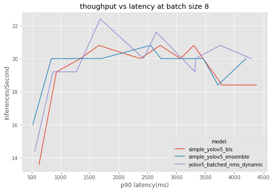

English | [Zh-CN](README_CN.md) 

# YOLOV5 optimization on Triton Inference Server

Deploy Yolov5 object detection service  in Triton. The following optimizations have been made:

1. [Lightweight Detect layer Output](./docs/custom_yolov5_detect_layer_EN.md)

2. [Integrate TensorRT BatchedNMSPlugin into engine](./docs/batchedNMS_EN.md) 

3. [Deploy via Triton Pipelines](./docs/pipelines_EN.md)

Pipelines are implemented through `Ensemble` and `BLS` respectively. The infer module in Pipelines is based on the optimized TensorRT Engine in item 1 above, and the Postprocess module is implemented through Python Backend. The workflow refers to [How to deploy Triton Pipelines](./docs/pipelines_EN.md#3-How_to_deploy_Triton_Pipelines).

---
## Environment
- CPU: 4cores 16GB
- GPU: Nvidia Tesla T4 
- Cuda: 11.6
- TritonServer: 2.20.0
- TensorRT: 8.2.3
- Yolov5: v6.1

---

## Benchmark
Triton Inference Server is deployed on one machine. Perf_analyzer is used to call the gRPC interface on another machine to compare the performance of `BLS Pipelines`, `Ensemble Pipelines`, and `BatchedNMS` under gradually increasing concurrency.

- [Generate real data](https://github.com/triton-inference-server/server/blob/main/docs/user_guide/perf_analyzer.md#real-input-data)

    ```shell
    python generate_input.py --input_images <image_path> ----output_file <real_data>.json
    ```

- Test with real data
  ```shell
  perf_analyzer  -m <triton_model_name>  -b 8  --input-data <real_data>.json  --concurrency-range 1:10  --measurement-interval 10000  -u <triton server endpoint> -i gRPC  -f <triton_model_name>.csv
  ```

The data shows that `BatchedNMS` performs better overall, converging to optimal performance faster under high concurrency, and achieving higher throughput at lower latency. `Ensemble Pipelines` and `BLS Pipelines` perform better at lower concurrency, but performance degrades more as concurrency increases. 




Six metrics are selected for comparison. Each metric is [processed](./triton/plot.ipynb#metrics-process) and normalized to the 0-1 interval. The original meaning of each metric is as follows:

- Server Queue: Data waiting time in Triton queue
- Server Compute Input: Triton input tensor processing time  
- Server Compute Infer: Triton inference execution time
- Server Compute Output: Triton output tensor processing time
- latency: 90th percentile end-to-end latency
- throughput: throughput


See [here](./docs/bls_vs_ensemble_EN.md#4-performance-analysis) for results analysis.
---

## REFERENCES


- [Ultralytics Yolov5](https://github.com/ultralytics/yolov5.git)
- [Yolov5 GPU Optimization](https://github.com/NVIDIA-AI-IOT/yolov5_gpu_optimization.git) 
- [TensorRT BatchedNMSPlugin](https://github.com/NVIDIA/TensorRT/tree/main/plugin/batchedNMSPlugin)
- [Perf Analyzer](https://github.com/triton-inference-server/server/blob/main/docs/user_guide/perf_analyzer.md)
- [Ensemble models](https://github.com/triton-inference-server/server/blob/main/docs/user_guide/architecture.md#ensemble-models)
- [Business Logic Scripting](https://github.com/triton-inference-server/python_backend#business-logic-scripting)