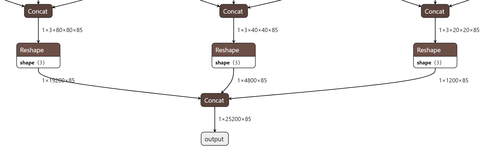
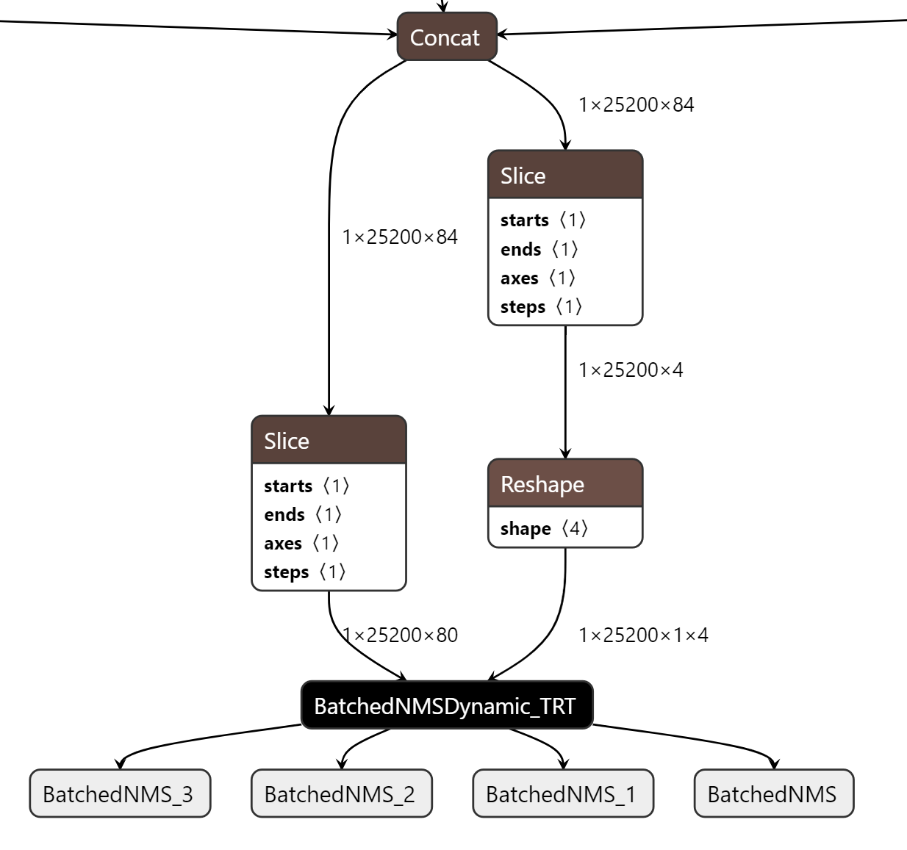

# YOLOV5 TensorRT BatchedNMS
在[修改yolov5的detect层](custom_yolov5_detect_layer.md)一文中，介绍了对detect层的轻量化改造，以提高模型服务的效率。在[部署yolov5 Triton Pipelines](pipelines.md)一文中利用改造的模型文件分别通过BLS和Ensemble两种方式部署了Triton Pipelines。但是Pipelines中的infer engine和nms始终是两个相对独立的step，由于nms是通过python backend来完成的，无论是BLS还是Ensemble都在数据传输方面存在一些限制。

本文利用onnx_graphsurgeon改造原生detect层的输出张量，对接通过cuda实现的TensorRT batchedNMSPlugin，将yolov5的nms集成到tensorrt engine中，避免部分场景下device to host的数据拷贝，提高整体计算性能。

## 0. 前置条件 
```shell
# clone ultralytics repo
git clone -b v6.1 https://github.com/ultralytics/yolov5.git
# clone this repo
git clone <this repo>
cp -r <this repo>/* yolov5/
```


--- 
## 1. 具体步骤

同[修改yolov5的detect层](custom_yolov5_detect_layer.md#3-具体步骤)大致类似，都是遵循:

- 修改detect层的forward函数
- 导出.onnx文件
- 转换为trt engine  

的步骤。只不过这里需要对导出onnx文件的函数进行一些修改，新增一个`BatchedNMSDynamic_TRT` node并追加到原始graph的末尾, 并按照[TensorRT batchedNMSPlugin的输入格式](https://github.com/NVIDIA/TensorRT/tree/main/plugin/batchedNMSPlugin#structure)调整node的属性


### 1.1 修改前后
- infer模式下forward函数原始输出格式  
   - squeezed boxes and classes:
        ```
        [batch_size, number_boxes, box_xywh + c + number_classes] = [batch_size, 25200, 85]
        ```

        


- 修改后的输出格式
  - boxes
    ```
    [batch_size, number_boxes, 1, x1y1x2y2]
     ```
  - cls_conf
    ```
    [batch_size, number_boxes, number_classes]
    ```

    


    根据[batchedNMSPlugin.cpp](https://github.com/NVIDIA/TensorRT/blob/main/plugin/batchedNMSPlugin/batchedNMSPlugin.cpp#L193)源码中的注释，boxes的输入形状为`[batch_size, num_boxes, num_classes, 4] or [batch_size, num_boxes, 1, 4]`，但`batchedNMSPlugin`的文档没有详细说明这二者的差别，在
    [efficientNMSPlugin](https://github.com/NVIDIA/TensorRT/tree/main/plugin/efficientNMSPlugin#boxes-input)的文档里可以找到相关的解释：

    > The boxes input can have 3 dimensions in case a single box prediction is produced for all classes (such as in EfficientDet or SSD), or 4 dimensions when separate box predictions are generated for each class (such as in FasterRCNN), in which case number_classes >= 1 and must match the number of classes in the scores input. The final dimension represents the four coordinates that define the bounding box prediction.

    由于使用的是yolov5, 所以不会对每个类别去生成bouding box, 所以boxes的输入形状应该为`[batch_size, num_boxes, 1, 4]`

### 1.2 改造detect层  

yolov5 Detect层forward函数的输出改成[TensorRT batchedNMSPlugin的输入格式](https://github.com/NVIDIA/TensorRT/tree/main/plugin/batchedNMSPlugin#structure)  

```python
def forward(self, x):
    z = []  # inference output
    for i in range(self.nl):
        x[i] = self.m[i](x[i])  # conv
        bs, _, ny, nx = x[i].shape  # x(bs,255,20,20) to x(bs,3,20,20,85)
        x[i] = x[i].view(bs, self.na, self.no, ny, nx).permute(0, 1, 3, 4, 2).contiguous()

        if not self.training:  # inference
            if self.onnx_dynamic or self.grid[i].shape[2:4] != x[i].shape[2:4]:
                self.grid[i], self.anchor_grid[i] = self._make_grid(nx, ny, i)

            y = x[i].sigmoid()
            if self.inplace:
                y[..., 0:2] = (y[..., 0:2] * 2 - 0.5 + self.grid[i]) * self.stride[i]  # xy
                y[..., 2:4] = (y[..., 2:4] * 2) ** 2 * self.anchor_grid[i]  # wh
            else:  # for YOLOv5 on AWS Inferentia https://github.com/ultralytics/yolov5/pull/2953
                xy = (y[..., 0:2] * 2 - 0.5 + self.grid[i]) * self.stride[i]  # xy
                wh = (y[..., 2:4] * 2) ** 2 * self.anchor_grid[i]  # wh
                # custom output >>>>>>>>>>>>>>>>>>>>>>>>>>>>>>>>>>>>>>>>>>>>>>>>>>>>>>>>
                conf = y[..., 4:]
                xmin = xy[..., 0:1] - wh[..., 0:1] / 2
                ymin = xy[..., 1:2] - wh[..., 1:2] / 2
                xmax = xy[..., 0:1] + wh[..., 0:1] / 2
                ymax = xy[..., 1:2] + wh[..., 1:2] / 2
                obj_conf = conf[..., 0:1]
                cls_conf = conf[..., 1:]
                cls_conf *= obj_conf 
                # y = torch.cat((xy, wh, y[..., 4:]), -1)
                y = torch.cat((xmin, ymin, xmax, ymax, cls_conf), 4)
            # z.append(y.view(bs, -1, self.no))
            z.append(y.view(bs, -1, self.no - 1))
    
    z = torch.cat(z, 1)
    bbox = z[..., 0:4].view(bs, -1, 1, 4)
    cls_conf = z[..., 4:]
    
    return bbox, cls_conf
    # return x if self.training else (torch.cat(z, 1), x)
    # custom output >>>>>>>>>>>>>>>>>>>>>>>>>>>>>>>>>>>>>>>>>>>>>>>>>>>>>>>>
```

### 1.3 修改export_onnx 
export onnx时，修改output，满足[TensorRT batchedNMSPlugin的输入格式](https://github.com/NVIDIA/TensorRT/tree/main/plugin/batchedNMSPlugin#structure)  

这里介绍一下关键点，详细代码见[export.py中的export_onnx函数](../export.py) 


- onnx simplify的时候避免导出成static shape  
    ```python
    model_onnx, check = onnxsim.simplify(
        model_onnx,
        dynamic_input_shape=dynamic
        # 必须注释
        #input_shapes={'images': list(im.shape)} if dynamic else None
        )
    ```


- 利用onnx-graphsurgeon创建一个`BatchedNMSDynamic_TRT` node，并添加到原有计算图的末尾

    ```python 
    # add batch NMS:
    yolo_graph = onnx_gs.import_onnx(model_onnx)
    box_data = yolo_graph.outputs[0]
    cls_data = yolo_graph.outputs[1]
    nms_out_0 = onnx_gs.Variable(
        "BatchedNMS",
        dtype=np.int32
    )
    nms_out_1 = onnx_gs.Variable(
        "BatchedNMS_1",
        dtype=np.float32
    )
    nms_out_2 = onnx_gs.Variable(
        "BatchedNMS_2",
        dtype=np.float32
    )
    nms_out_3 = onnx_gs.Variable(
        "BatchedNMS_3",
        dtype=np.float32
    )
    nms_attrs = dict()
    # ........

    nms_plugin = onnx_gs.Node(
        op="BatchedNMSDynamic_TRT",
        name="BatchedNMS_N",
        inputs=[box_data, cls_data],
        outputs=[nms_out_0, nms_out_1, nms_out_2, nms_out_3],
        attrs=nms_attrs
    )
    yolo_graph.nodes.append(nms_plugin)
    yolo_graph.outputs = nms_plugin.outputs
    yolo_graph.cleanup().toposort()
    model_onnx = onnx_gs.export_onnx(yolo_graph)
    ```


- 依次导出onnx和tensorrt engine
    ```shell
    # export onxx
    python export.py --weights yolov5s.pt --include onnx --simplify --dynamic 

    # export trt engine
    /usr/src/tensorrt/bin/trtexec  \
    --onnx=yolov5s.onnx \
    --minShapes=images:1x3x640x640 \
    --optShapes=images:1x3x640x640 \
    --maxShapes=images:1x3x640x640 \
    --workspace=4096 \
    --saveEngine= yolov5s_opt1_max1_fp16.engine \
    --shapes=images:1x3x640x640 \
    --verbose \
    --fp16 \
    > result-FP16-BatchedNMS.txt
    ```
---

## 2. 性能测试

### 2.1  COCO17 validation数据集测试

对比测试infer + nms的耗时

- original yolo  

    ```shell
    python detect.py --weight original-yolov5s-fp16.engine --half --img 640  --source </path/to/coco/images/val2017/> --device 0 
    ```
    
    Speed: 0.8ms pre-process, 4.4ms inference, 2.2ms NMS per image at shape (1, 3, 640, 640)

- batchedNMSPlugin

    ```shell
    python trt_infer.py --model yolov5s_opt1_max1_fp16.engine --input_images_folder </path/to/coco/images/val2017/> --output_images_folder <output_tempfolder> --input_size 640
    ```

    infer + nms:  
    Inference: 5.4 ms  per image at shape (1, 3, 640, 640)


### 2.2 trtexec 测试

trtexec是本地测试结果，batch为1的情况下，整体差别不太大，将nms集成到trt engine后，Output的张量变小了很多，可以降低Device to Host的数据传输时间，代价是GPU Compute的时间增加

metrics|BatchedNMSDynamic_TRT egine<br>infer+nms|ultralytics engine<br>only infer|
:-:|:-:|:-:|
Latency|3.97021 ms|4.08145 ms|
End-to-End Host Latency|6.70715 ms|4.73285 ms|
Enqueue Time|1.27597 ms|0.95929 ms|
H2D Latency|0.563791 ms|0.316406 ms|
GPU Compute Time|3.45068 ms| 2.41992 ms|
D2H Latency|0.0100889 ms|1.34198 ms|

---
## REFERENCES


- [Ultralytics Yolov5](https://github.com/ultralytics/yolov5.git)
- [Yolov5 GPU Optimization](https://github.com/NVIDIA-AI-IOT/yolov5_gpu_optimization.git)
- [TensorRT BatchedNMSPlugin ](https://github.com/NVIDIA/TensorRT/tree/main/plugin/batchedNMSPlugin)