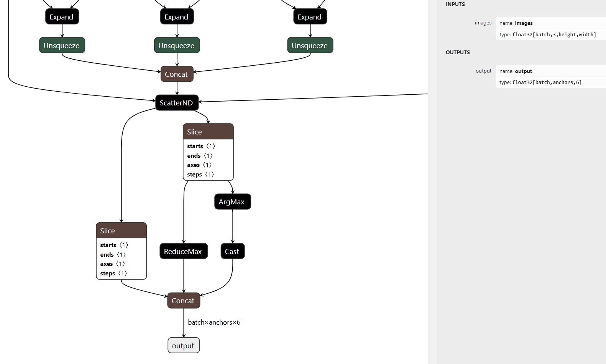

# Modify yolov5 detect layer to improve Triton inference serving performance

In infer mode, the default yolov5 detect layer outputs a tensor with shape `[batches, 25200, 85]`. When deployed in `Nvidia Triton`, the large output tensor size increases output processing time and causes queue backlogs. Especially when `Triton Server` and `Client` are not on the same machine and cannot use `shared memory`, the network transfer time to client is even longer, affecting inference serving performance.

---

## 1. Test method

Convert the model to tensorrt engine and deploy on Triton Inference Server with 1 GPU instance group. Use the perf_analyzer tool provided by Triton to test performance on another machine.

- Convert yolov5s.pt to onnx format
- Convert onnx to tensorrt engine

  ```shell
  /usr/src/tensorrt/bin/trtexec  \
  --onnx=yolov5s.onnx \
  --minShapes=images:1x3x640x640 \
  --optShapes=images:8x3x640x640 \
  --maxShapes=images:32x3x640x640 \ 
  --workspace=4096 \
  --saveEngine=yolov5s.engine \
  --shapes=images:1x3x640x640 \
  --verbose \
  --fp16 \
  > result-FP16.txt
  ```

- Deploy on Triton Inference Server

  Upload model to Triton server's configured model repository path and write [model config](../triton/model_repository/simple_yolov5/config.pbtxt)

- [Generate real data](https://github.com/triton-inference-server/server/blob/main/docs/user_guide/perf_analyzer.md#real-input-data)

  ```shell
  python ./triton/generate_input.py --input_images <image_path> ----output_file <real_data>.json
  ```

- Performance testing with real data

  ```shell
  perf_analyzer -m <triton_model_name> -b 1 --input-data <real_data>.json --concurrency-range 1:10 --measurement-interval 10000 -u <triton server endpoint> -i gRPC -f <triton_model_name>.csv
  ```

---

## 2. Performance metrics before modification

Below are the performance test results of deploying default yolov5 trt engine on triton. It can be seen that with the default detect layer, a lot of time is spent on queue backlogs (`Server Queue`) and output data processing (`Server Compute Output`). The throughput is even less than `1 infer/sec`.

> Except for throughput, the units for other metrics are us. Client Send and Client Recv are the times for gRPC serialization and deserialization. 

| Concurrency | Inferences/Second | Client Send | Network+Server Send/Recv | Server Queue | Server Compute Input | Server Compute Infer | Server Compute Output | p90 latency |
| ----------- | ----------------- | ----------- | ------------------------ | ------------ | -------------------- | -------------------- | --------------------- | ----------- |   
| 1           | 0.7               | 1683        | 1517232                  | 466          | 8003                 | 4412                 | 9311                  | 1592936     |
| 2           | 0.8               | 1464        | 1514475                  | 393          | 10659                | 4616                 | 956736                | 2583025     |
| 3           | 0.7               | 2613        | 1485868                  | 1013992      | 7370                 | 4396                 | 1268070               | 3879331     |
| 4           | 0.7               | 2268        | 1463386                  | 2230040      | 9933                 | 5734                 | 1250245               | 4983687     |
| 5           | 0.6               | 2064        | 1540583                  | 3512025      | 11057                | 4843                 | 1226058               | 6512305     |
| 6           | 0.6               | 2819        | 1573869                  | 4802885      | 10134                | 4320                 | 1234644               | 7888080     | 
| 7           | 0.5               | 1664        | 1507386                  | 6007235      | 11197                | 4899                 | 1244482               | 8854777     |
|             |                   |             |                          |              |                      |                      |                       |             |

Therefore, one optimization approach is to streamline the data layer and coarsely filter bboxes by conf before nms. Finally, refer to the processing of the detect layer in tensorrtx to change the output to a vector with shape `[batches, num_bboxes, 6]`, where `num_bboxes=1000`. 

> `6 = [cx,cy,w,h,conf,cls_id]`, where `conf = obj_conf * cls_prob`

---

## 3. Specific steps

### 3.1 Clone ultralytics yolov5 repo

`git clone -b v6.1 https://github.com/ultralytics/yolov5.git`

### 3.2 Modify detect layer

Change the detect forward function to:

```python
def forward(self, x):
    z = []  # inference output
    for i in range(self.nl):
        x[i] = self.m[i](x[i])  # conv
        bs, _, ny, nx = x[i].shape  # x(bs,255,20,20) to x(bs,3,20,20,85)
        x[i] = x[i].view(bs, self.na, self.no, ny, nx).permute(0, 1, 3, 4, 2).contiguous()

        if not self.training:  # inference
            if self.onnx_dynamic or self.grid[i].shape[2:4] != x[i].shape[2:4]:
                self.grid[i], self.anchor_grid[i] = self._make_grid(nx, ny, i)

            y = x[i].sigmoid()
            if self.inplace:
                y[..., 0:2] = (y[..., 0:2] * 2 - 0.5 + self.grid[i]) * self.stride[i]  # xy
                y[..., 2:4] = (y[..., 2:4] * 2) ** 2 * self.anchor_grid[i]  # wh
            else:  # for YOLOv5 on AWS Inferentia https://github.com/ultralytics/yolov5/pull/2953
                xy = (y[..., 0:2] * 2 - 0.5 + self.grid[i]) * self.stride[i]  # xy
                wh = (y[..., 2:4] * 2) ** 2 * self.anchor_grid[i]  # wh
                y = torch.cat((xy, wh, y[..., 4:]), -1)
            z.append(y.view(bs, -1, self.no))

    # custom output >>>>>>>>>>>>>>>>>>>>>>>>>>>>>>>>>>>>>>>>>>>>>>>>>>>>>>>> 
    # [bs, 25200, 85]  
    origin_output = torch.cat(z, 1)
    output_bboxes_nums = 1000
    # operator argsort to ONNX opset version 12 is not supported.
    # top_conf_index = origin_output[..., 4].argsort(descending=True)[:,:output_bboxes_nums]

    # [bs, 1000]
    top_conf_index =origin_output[..., 4].topk(k=output_bboxes_nums)[1]

    # torch.Size([bs, 1000, 85])
    filter_output = origin_output.gather(1, top_conf_index.unsqueeze(-1).expand(-1, -1, 85))

    filter_output[...,5:] *= filter_output[..., 4].unsqueeze(-1)  # conf = obj_conf * cls_conf
    bboxes =  filter_output[..., :4]
    conf, cls_id = filter_output[..., 5:].max(2, keepdim=True)
    # [bs, 1000, 6] 
    filter_output = torch.cat((bboxes, conf, cls_id.float()), 2)

    return x if self.training else filter_output
    # custom output >>>>>>>>>>>>>>>>>>>>>>>>>>>>>>>>>>>>>>>>>>>>>>>>>>>>>>>>
    
    # return x if self.training else (torch.cat(z, 1), x)
```

### 3.3 Export onnx

When exporting onnx, comment out the following code in `onnx simplify` to avoid exporting static shape onnx model:

```python
model_onnx, check = onnxsim.simplify(
    model_onnx,
    dynamic_input_shape=dynamic
    # must comment out
    #input_shapes={'images': list(im.shape)} if dynamic else None
    )
```

Run `python export.py --weight yolov5s.pt --dynamic --simplify --include onnx` to export onnx model. The exported onnx structure is:



### [3.4 Export tensorrt engine](#1-test-method)

---

## 4. Performance after modification

- Batch size = 1

  Throughput increased by more than 25 times. `Server Queue` and `Server Compute Output` times were also significantly reduced.

  | Concurrency | Inferences/Second | Client Send | Network+Server Send/Recv | Server Queue | Server Compute Input | Server Compute Infer | Server Compute Output | Client Recv | p90 latency |
  | ----------- | ----------------- | ----------- | ------------------------ | ------------ | -------------------- | -------------------- | --------------------- | ----------- | ----------- |
  | 1           | 11.9              | 1245        | 69472                    | 286          | 7359                 | 5022                 | 340                   | 3           | 93457       |
  | 2           | 19.2              | 1376        | 89804                    | 341          | 7538                 | 4997                 | 161                   | 3           | 118114      |
  | 3           | 20.2              | 1406        | 131265                   | 1500         | 8240                 | 4881                 | 500                   | 3           | 171370      |
  | 4           | 20                | 1382        | 180621                   | 2769         | 9051                 | 5184                 | 496                   | 3           | 235043      |
  | 5           | 20.5              | 1362        | 226046                   | 2404         | 8112                 | 5068                 | 622                   | 3           | 286810      |
  | 6           | 20.8              | 1487        | 271714                   | 2034         | 8331                 | 5076                 | 506                   | 3           | 406248      |
  | 7           | 20.1              | 1535        | 328144                   | 2626         | 8444                 | 5122                 | 405                   | 3           | 430850      |
  | 8           | 19.9              | 1512        | 384690                   | 3511         | 8168                 | 5018                 | 581                   | 5           | 465658      |
  | 9           | 20.2              | 1433        | 420893                   | 3499         | 9034                 | 5180                 | 389                   | 3           | 522285      |
  | 10          | 20.5              | 1476        | 469029                   | 3369         | 8280                 | 5165                 | 442                   | 3           | 622745      |
  |             |                   |             |                          |              |                      |                      |                       |             |             |

- Batch size = 8

  Compared to batch size = 1, `Server Compute Input`, `Server Compute Infer`, and `Server Compute Output` speeds improved by about 1.4x, 2x, and 4x respectively. The cost is that data transfer time increases as batch size grows.

  | Concurrency | Inferences/Second | Client Send | Network+Server Send/Recv | Server Queue | Server Compute Input | Server Compute Infer | Server Compute Output | Client Recv | p90 latency |
  | ----------- | ----------------- | ----------- | ------------------------ | ------------ | -------------------- | -------------------- | --------------------- | ----------- | ----------- |
  | 1           | 15.2              | 11202       | 527075                   | 360          | 5386                 | 2488                 | 43                    | 5           | 570189      |
  | 2           | 18.4              | 10424       | 829927                   | 124          | 5780                 | 2491                 | 33                    | 4           | 901743      |
  | 3           | 20                | 10203       | 1178111                  | 2290         | 5640                 | 2570                 | 20                    | 4           | 1267145     |
  | 4           | 20                | 10097       | 1595614                  | 4843         | 5998                 | 2454                 | 104                   | 5           | 1716309     |
  | 5           | 19.2              | 9117        | 1971608                  | 2397         | 5376                 | 2480                 | 203                   | 4           | 2518530     |
  | 6           | 20                | 8728        | 2338066                  | 2914         | 6304                 | 2496                 | 96                    | 4           | 2706257     |
  | 7           | 20                | 14785       | 2708292                  | 6581         | 5556                 | 2489                 | 160                   | 5           | 3170047     |
  | 8           | 20                | 13035       | 3052707                  | 5067         | 6353                 | 2492                 | 62                    | 4           | 3235293     |
  | 9           | 17.6              | 10870       | 3535601                  | 7037         | 6307                 | 2480                 | 136                   | 5           | 3856391     |
  | 10          | 18.4              | 9357        | 3953830                  | 8044         | 5629                 | 2520                 | 64                    | 3           | 4531638     |
  |             |                   |             |                          |              |                      |                      |                       |             |             |


---

## REFERENCES

- [Ultralytics Yolov5](https://github.com/ultralytics/yolov5.git)  
- [Perf Analyzer](https://github.com/triton-inference-server/server/blob/main/docs/user_guide/perf_analyzer.md)