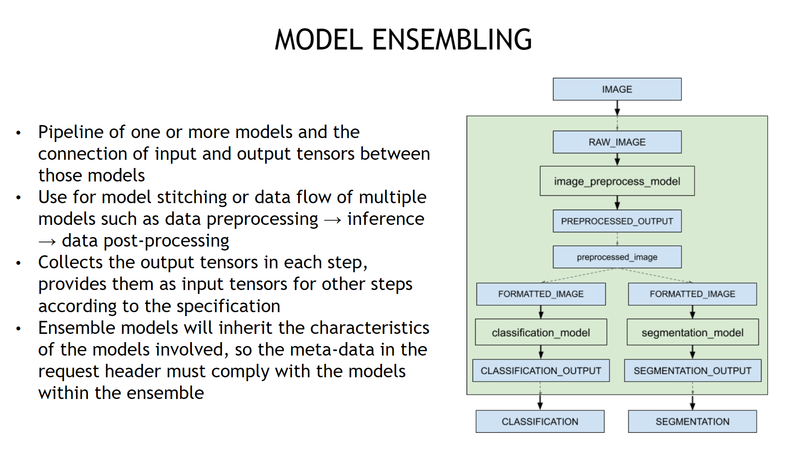
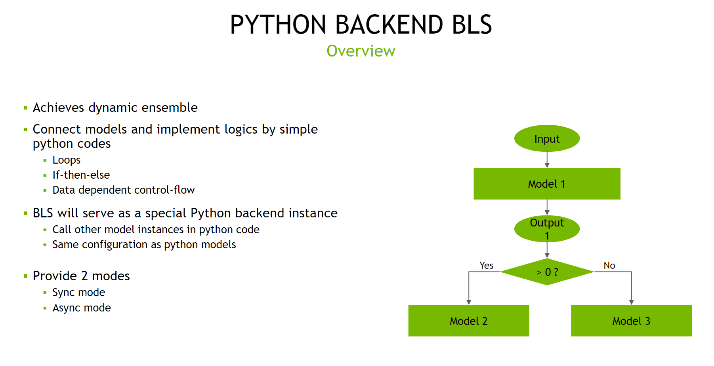
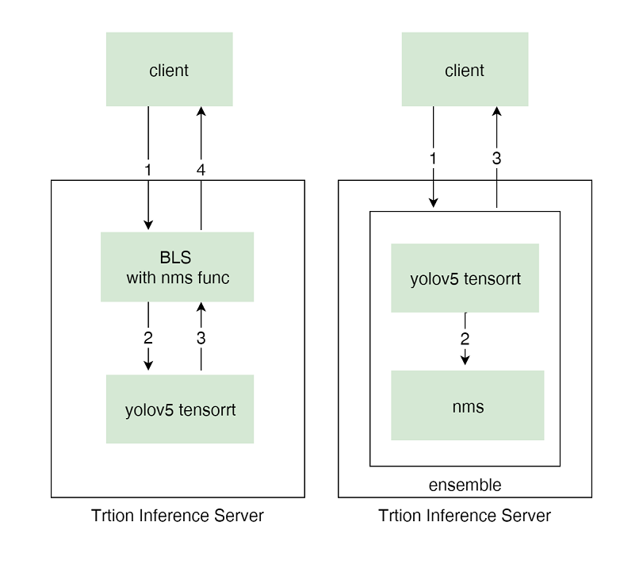

# 部署yolov5 Triton Pipelines

## 1. 为什么使用Triton pipelines

众所周知，模型服务不仅包含 GPU based Inference，还包括preprocess和postprocess。Triton Pipelines是一种workflow, 它可以组合不同的模型服务组合成一个完整的应用, 同一个模型服务还可以被不同的workflow使用。  
因此可以单独将preprocess或postprocess单独部署，然后通过Pipeline将它们和infer模块串联起来。这样做的好处是: 
- 每个子模块都可以分别申请不同种类和大小的资源、配置不同的参数，以达到最大化模型服务效率的同时，充分利用计算资源。

-  可以避免传输中间张量的开销，减小通过网络传输的数据大小，并最大限度地减少必须发送到 Triton 的请求数量。

---

## 2. Triton Pipelines的实现方式
Nvidia Triton提供了两种Pipleline的部署方式：分别为Business Logic Scripting(BLS)和Ensemble。下面简单介绍一下这两种方式。

- [Ensemble](https://github.com/triton-inference-server/server/blob/main/docs/user_guide/architecture.md#ensemble-models)  
通过组合model repository里的各类模型成为一个workflow。是一种pipeline调度策略，而不是具体的model。 ensemble效率更高，但无法加入条件逻辑判断，数据只能按照设定的pipeline流动，适合pipeline结构固定的场景


- [BLS](https://github.com/triton-inference-server/python_backend#business-logic-scripting)  
一种特殊的python backend，通过python code调用其他model instance。BLS灵活性更高，可以加入一些逻辑和循环来动态组合不同的模型，从而控制数据的流动方向。


---

## 3. 如何部署Triton Pipelines

通过Pipelines部署process模块的一个出发点是，减小通过网络传输的数据大小。在目标检测模型服务中，输入端的raw_image和nms之前的candidate bboxes的数据量都是相对较大，因此一个合适的方案就是将nms这一postprecess模块单独通过python backend部署，通过pipelines连接infer和nms模块，client则需要对raw_data进行必要的resize等preprocess操作。


### 3.1 工作流
Pipleine配置及python backend参考Model Repository的[ensemble](../triton/model_repository/simple_yolov5_ensemble/)和[bls](../triton/model_repository/simple_yolov5_bls/)

两种部署方式的工作流如下:  




### 3.2 BLS

- 数据流向
    1. 通过http/gRPC发送resize后的image到BLS模型服务
    2. BLS服务通过C API调用yolov5 tensorrt模型服务
    3. Triton Server将candidate bboxes返回给BLS服务
    4. BLS服务对candidate bboxes进行nms操作，将最终的bboxes通过http/gRPC返回给client

 

### 3.3 Ensemble

- 数据流向
    1. 通过http/gRPC发送resize后的image到ensemble模型服务
    2. ensemble模型服务通过memory copy将yolov5 tensorrt的输出的candidate bboxes传递给nms模型服务
    3. ensemble模型服务将nms输出的bboxes通过http/gRPC返回给client

### 3.3 Notice

NMS输出的bboxes数量不固定，一般有三种处理方式：

1. 对bboxes做padding, 例如规定输出是 `[batch_size, padding_count, xywh or xyxy]`, 其中 pandding_count 根据实际场景来确定
2. 将模型的输出结果放到一个 json, 以 `json string ([N, 1])` 的形式返回
3. 采用将 response [解耦的方式](https://github.com/triton-inference-server/python_backend#decoupled-mode)

本文采用padding的方式来解决该问题
```python
from torch.nn import functional as F
i = torchvision.ops.nms(boxes, scores, nms_threshold)
# padding boxes to 300
if i.shape[0] > max_det:  # limit detections
    i = i[:max_det]
bbox_pad_nums = max_det - i.shape[0]
output_bboxes[xi] = F.pad(x[i], (0,0,0, bbox_pad_nums), value=0)
```

---
## REFERENCES


- [Ultralytics Yolov5](https://github.com/ultralytics/yolov5.git)
- [Ensemble models](https://github.com/triton-inference-server/server/blob/main/docs/user_guide/architecture.md#ensemble-models)
- [Business Logic Scripting](https://github.com/triton-inference-server/python_backend#business-logic-scripting)
- [Triton 从入门到精通](https://space.bilibili.com/1320140761/channel/collectiondetail?sid=493256)